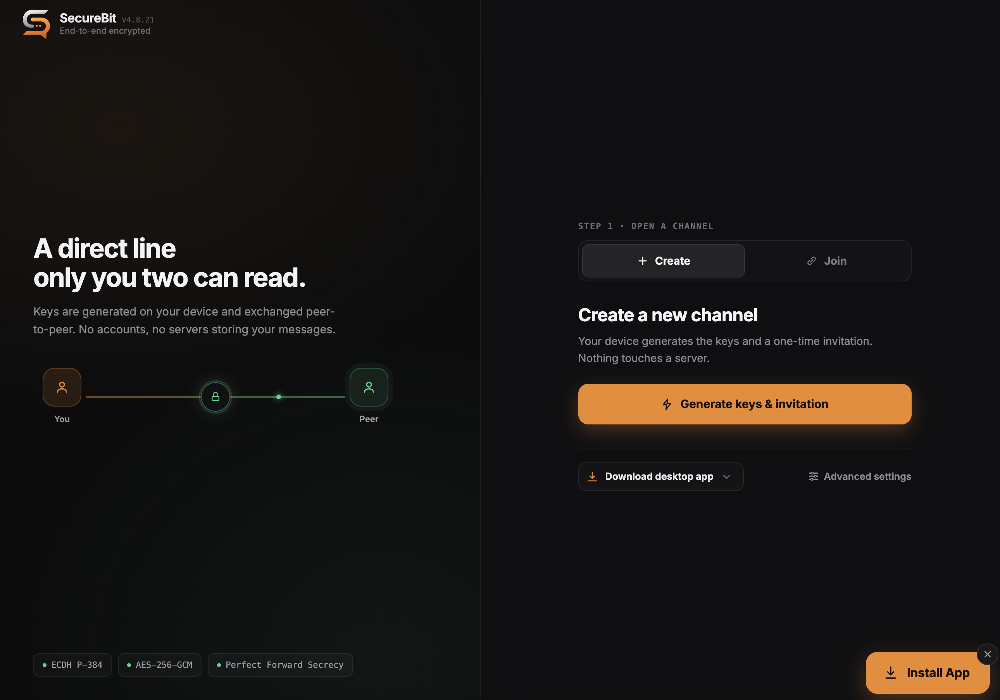
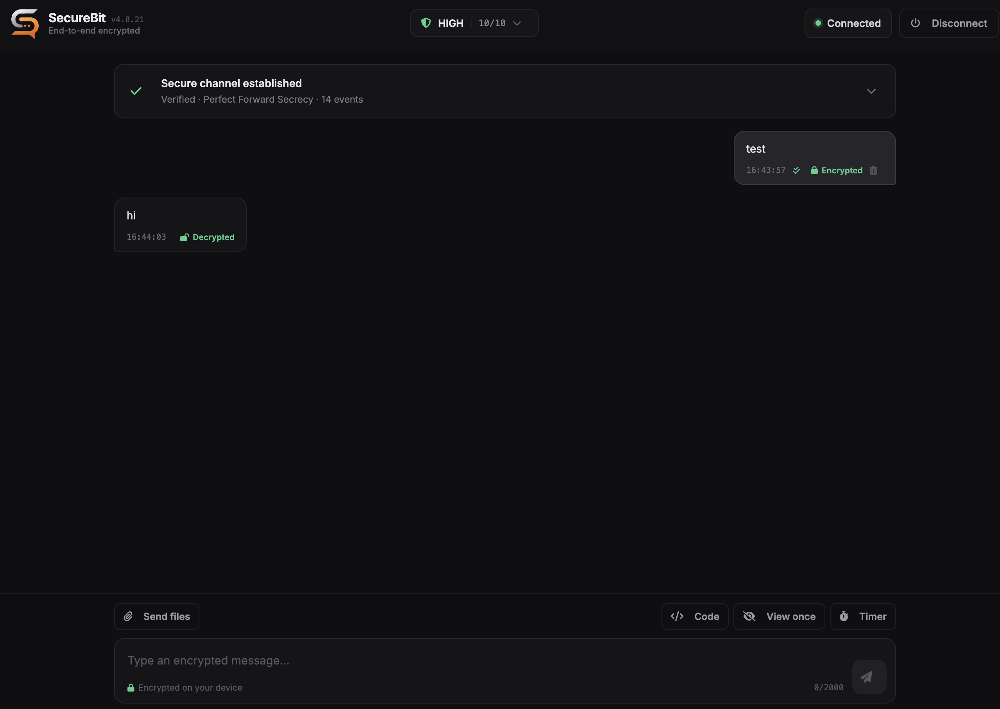

<div align="center">


# SecureBit.chat

**End-to-end encrypted, peer-to-peer chat that runs entirely in your browser.**

No accounts. No servers storing your messages. No installation required.

[](LICENSE)
[](CHANGELOG.md)
[](#install-as-an-app)
[](#security-model)

[Features](#features) · [How it works](#how-it-works) · [Security](#security-model) · [Quick start](#quick-start) · [Documentation](#documentation)

</div>

---

SecureBit.chat is a browser-based, peer-to-peer messenger built on **WebRTC** and the **Web Crypto API**. Two people establish a direct, end-to-end encrypted channel and verify each other in person — there is no registration, no central server relaying or storing messages, and no metadata account to leak. Everything cryptographic happens locally in the two browsers.

It is designed for people who need a small, auditable, zero-infrastructure way to talk privately: journalists and sources, security researchers, or anyone who simply wants a conversation that leaves nothing behind.

## Screenshots

| Open a secure channel | Encrypted conversation |
| :---: | :---: |
|  |  |

## Features

** Encryption & verification**
- ECDH P-384 key agreement with derived per-session keys, AES-256-GCM payloads, and DTLS-protected transport.
- Interactive **Short Authentication String (SAS)** verification — you confirm a code out-of-band before the session is trusted, defeating man-in-the-middle attacks.
- Replay protection, message integrity (HMAC), and a live security report you can open at any time during a call.

** Privacy by design**
- Direct peer-to-peer connection — messages never touch a SecureBit server.
- No accounts, no phone numbers, no message history on disk.
- Optional **relay-only mode** routes traffic through your own TURN server so your IP is never exposed to the peer.
- Local key metadata is stored encrypted in IndexedDB; disconnecting cleans up session state.

** Messaging**
- Code blocks with syntax highlighting and an auto-clearing copy button.
- View-once and disappearing messages with countdown timers.
- Unsend (delete for everyone) over the authenticated control channel.
- WhatsApp-style delivery status (sending → sent → delivered) with offline store-and-forward.

**Multiple conversations**
- Run several independent chats at the same time. Every conversation gets its own encrypted session, keys and verification, so two chats can never mix.
- A side panel lists your open chats with unread badges. Switching is instant, and starting a new chat leaves the others connected.
- Set your availability (Available, Away, Busy or Invisible) and connected peers can see it. You can also give each chat a private label that is stored only on your device and is never sent to the other side.

** File transfer**
- Consent-gated, end-to-end encrypted transfers with resumable, per-chunk progress.
- Strict file-type allowlist; executable and scriptable formats are rejected.

** Progressive Web App**
- Installable on desktop and mobile, works offline, and ships update notifications.

## How it works

SecureBit never sees your conversation. A session is built directly between the two browsers:

```
   Peer A                         Peer B
     │   1. create encrypted offer   │
     │ ────────────────────────────► │   (shared out-of-band: QR / link / paste)
     │                               │
     │   2. return encrypted answer  │
     │ ◄──────────────────────────── │
     │                               │
     │   3. compare SAS code aloud   │
     │  ✓ both confirm  → verified   │
     │                               │
     │ ═══ end-to-end encrypted ════ │
```

1. **Peer A** creates an offer (sharable as a QR code, link, or text).
2. **Peer B** opens it and returns an answer the same way.
3. Both sides see a **SAS code** and compare it over a trusted channel (in person, a call you recognize, etc.).
4. Only after both peers confirm the matching code does the chat unlock. Three failed attempts terminate the session.

## Security model

| Layer | Mechanism |
| --- | --- |
| Key agreement | ECDH (P-384), per-session derived keys |
| Transport | WebRTC data channel over DTLS |
| Message encryption | AES-256-GCM, end-to-end |
| Authentication | Interactive SAS bound to both peers' DTLS fingerprints |
| Integrity | HMAC + replay protection |
| Sanitization | DOMPurify text-only rendering boundary |
| Local storage | Encrypted key metadata in IndexedDB |

A session is **not** treated as verified until both peers complete the SAS flow. This is the step that protects you against a man-in-the-middle: the code must be compared through a channel an attacker cannot impersonate.

> [!WARNING]
> SecureBit.chat is privacy software, not a guarantee. View-once and disappearing messages are cooperative (not screenshot-proof), and a TURN relay can observe both peers' IPs and traffic timing — though never message contents. See [`SECURITY_DISCLAIMER.md`](SECURITY_DISCLAIMER.md).

## Quick start

### Run locally

```bash
npm install
npm run build
npm run serve
```

Open the printed local URL in two browser windows or profiles, then:

1. Create an offer in the first window.
2. Transfer it to the second and create an answer.
3. Return the answer to the first window.
4. Compare the SAS code out-of-band and enter it on both sides.
5. Start chatting once both peers are verified.

### Install as an app

SecureBit is a PWA — open it in a supported browser and choose **Install** (or *Add to Home Screen* on mobile) to run it as a standalone, offline-capable app.

## Configuration

### TURN / privacy mode

Direct WebRTC connections can reveal IP addresses to the peer. SecureBit supports a relay-only privacy mode:

- **Default** keeps standard WebRTC behavior with public STUN.
- **Relay-only** sets `iceTransportPolicy: "relay"` and requires a configured TURN server.
- STUN alone does not hide IP addresses; public TURN credentials are never bundled.

Configure your own STUN/TURN servers under **Advanced network settings**, or at deployment time. See [`doc/CONFIGURATION.md`](doc/CONFIGURATION.md).

### File transfer policy

Incoming transfers require explicit consent. Metadata is validated and dangerous names rejected before the prompt appears. Accepted: common raster images, PDF, plain text, and ZIP. Executable/scriptable formats (`.exe`, `.bat`, `.sh`, `.js`, `.msi`, `.dmg`, `.jar`, `.ps1`, `.vbs`, `.html`, `.svg`, …) are blocked, and MIME type must agree with the file extension.

## Development

**Requirements:** Node.js 18+ and npm.

```bash
npm install
npm test          # run the test suite
npm audit         # check dependencies
npm run build     # build CSS + JS bundles and refresh meta.json
npm run dev       # build and serve locally
```

### Project structure

```text
src/network/      WebRTC connection and session lifecycle
src/transfer/     secure file-transfer implementation
src/crypto/       cryptographic utilities
src/components/   React UI components
src/styles/       component styles
doc/              technical documentation
dist/             built bundles served in production
```

## Documentation

- [`SECURITY.md`](SECURITY.md) — security policy & reporting
- [`doc/CONFIGURATION.md`](doc/CONFIGURATION.md) — deployment & ICE configuration
- [`doc/CRYPTOGRAPHY.md`](doc/CRYPTOGRAPHY.md) — cryptographic design
- [`doc/SECURITY-ARCHITECTURE.md`](doc/SECURITY-ARCHITECTURE.md) — architecture overview
- [`doc/API.md`](doc/API.md) — internal APIs
- [`CHANGELOG.md`](CHANGELOG.md) — full release history

## Contributing & responsible use

Issues and pull requests are welcome. SecureBit.chat is intended for lawful, ethical communication only — please read [`RESPONSIBLE_USE.md`](RESPONSIBLE_USE.md) before using or contributing.

## License

Released under the [MIT License](LICENSE).

<div align="center">
<sub>Built with WebRTC and the Web Crypto API · No servers, no accounts, no compromises.</sub>
</div>
