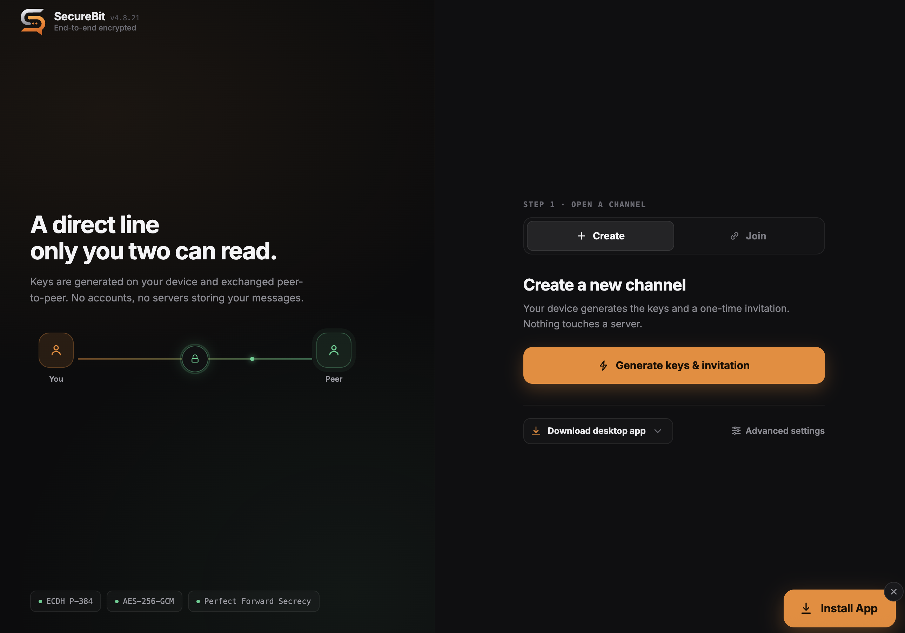
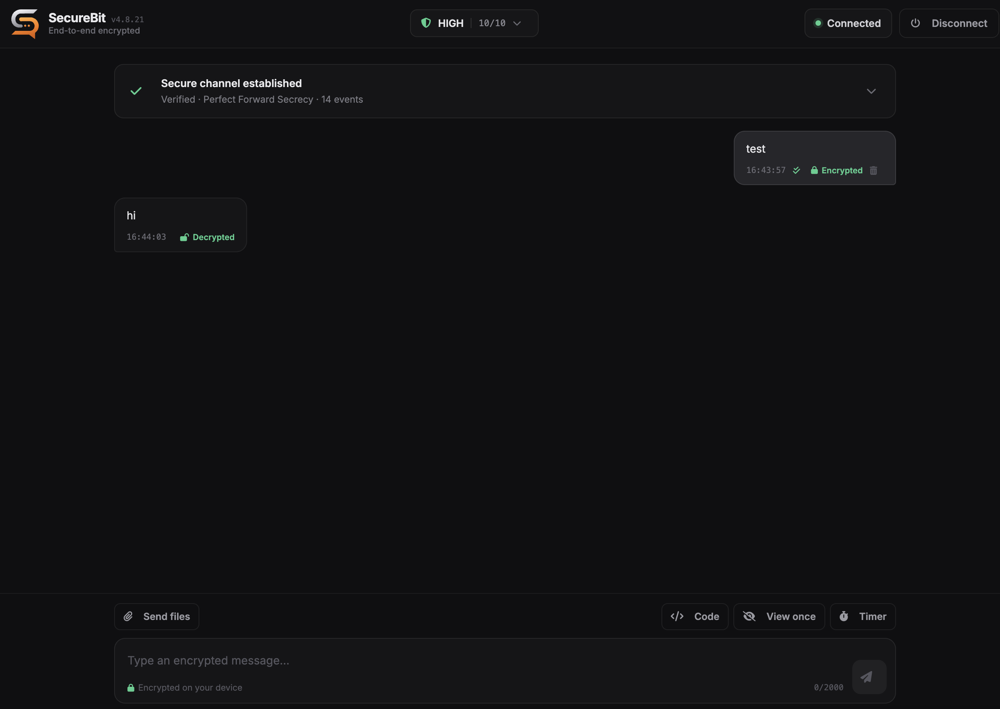

<div align="center">


# SecureBit.chat

**End-to-end encrypted, peer-to-peer chat that runs entirely in your browser.**

No accounts. No servers storing your messages. No installation required.

[](LICENSE)
[](CHANGELOG.md)
[](#install-as-an-app)
[](#security-model)
[](#forward-secrecy)

[Features](#features) · [How it works](#how-it-works) · [Security](#security-model) · [Quick start](#quick-start) · [Documentation](#documentation)

</div>

---

SecureBit.chat is a browser-based, peer-to-peer messenger built on **WebRTC** and the **Web Crypto API**. Two people establish a direct, end-to-end encrypted channel and verify each other in person. There is no registration, no central server relaying or storing messages, and no account whose metadata can leak. Everything cryptographic happens locally in the two browsers.

It is designed for people who need a small, auditable, zero-infrastructure way to talk privately: journalists and sources, security researchers, or anyone who simply wants a conversation that leaves nothing behind.

## Screenshots

| Open a secure channel | Encrypted conversation |
| :---: | :---: |
|  |  |

## Features

**Encryption and verification**
- ECDH P-384 key agreement with derived per-session keys, AES-256-GCM payloads, and DTLS-protected transport.
- **Double Ratchet forward secrecy.** Every message is encrypted with its own key, and the session re-keys itself each time the conversation changes direction. See [Forward secrecy](#forward-secrecy).
- Interactive **safety code** verification. You confirm a short code out of band before the session is trusted, which is what defeats a man in the middle.
- **A minimal invitation.** The code you hand over carries only what is needed to open the connection — roughly 110 to 150 bytes, one QR code. Keys and signatures no longer travel with it; they move over the connection itself, pinned by a commitment inside the invitation. See [The invitation](#the-invitation).
- Replay protection, message integrity (HMAC), and a live security report you can open at any time during a call.

**Privacy by design**
- Direct peer-to-peer connection. Messages never touch a SecureBit server.
- No accounts, no phone numbers, no message history on disk.
- Optional **relay-only mode** routes traffic through your own TURN server so your IP is never exposed to the peer.
- Local key metadata is stored encrypted in IndexedDB; disconnecting cleans up session state.

**Encrypted calls**
- **One-to-one voice and video calls** over the same verified connection. Media rides the verified DTLS-SRTP transport, so calls inherit the session's end-to-end encryption and never traverse a SecureBit server.
- **Adaptive audio**: Opus with in-band FEC, DTX and RED redundancy for intelligible speech at 15 to 20 percent packet loss; audio is prioritised and never throttled by the network controller.
- **Adaptive video**: VP9/AV1 single-encoding SVC (H.264/VP8 fallback) that degrades by spatial/temporal layer, with a runtime controller that trims video bitrate on loss/RTT and recovers as the link clears.
- **Live connection-quality indicator** (Excellent, Good, Fair, Weak) shown during a call, plus in-call mute and video controls.

**Messaging**
- **Encrypted voice messages.** Record in the browser and send over the same end-to-end encrypted transfer channel as files. Audio is captured as PCM/WAV, integrity-protected by a signed hash, and played back inline on the recipient's device without ever touching disk.
- Code blocks with syntax highlighting and an auto-clearing copy button.
- View-once and disappearing messages with countdown timers.
- Unsend (delete for everyone) over the authenticated control channel.
- Delivery status (sending, sent, delivered) with offline store-and-forward.

**Multiple conversations**
- Run several independent chats at the same time. Every conversation gets its own encrypted session, keys and verification, so two chats can never mix.
- A side panel lists your open chats with unread badges. Switching is instant, and starting a new chat leaves the others connected.
- Set your availability (Available, Away, Busy or Invisible) and connected peers can see it. You can also give each chat a private label that is stored only on your device and is never sent to the other side.

**File transfer**
- Consent-gated, end-to-end encrypted transfers with resumable, per-chunk progress.
- Strict file-type allowlist; executable and scriptable formats are rejected.

**Progressive Web App**
- Installable on desktop and mobile, works offline, and ships update notifications.

## How it works

SecureBit never sees your conversation. A session is built directly between the two browsers:

```
   Peer A                              Peer B
     |                                   |
     |  1. invitation (one QR, ~110-150 B)
     |.................................> |   carried by QR, link or paste
     |                                   |
     |                    2. response    |
     | <.................................|
     |                                   |
     |  3. keys exchanged over the open   |
     |<===== connection, checked =======>|   against the invitation's commitment
     |                                   |
     |  4. both read the same safety code
     |     and compare it out loud       |
     |                                   |
     |  5. both confirm, session verified
     |                                   |
     |===== end-to-end encrypted ========|
```

1. **Peer A** creates an invitation, shareable as a QR code, a link or plain text. It is small enough to be a single QR code — point a camera at it and it is read in one go.
2. **Peer B** opens it and returns a response the same way.
3. The two browsers finish the key exchange **over the connection they just opened**, not inside the invitation. Each side checks the other's keys against a fingerprint-sized commitment that was in the invitation before accepting them.
4. Both sides now show the same **safety code**. Compare it over something an attacker cannot impersonate: in person, or a voice you recognise.
5. The chat unlocks only after both people confirm the matching code. Three incorrect attempts end the session.

Step 4 is not a formality. Completing the key exchange proves that someone completed it, not who. Anyone able to intercept and rewrite the invitation can do that with both of you at once, and comparing the code is what catches it.

## Security model

| Layer | Mechanism |
| --- | --- |
| Key agreement | ECDH (P-384), per-session derived keys |
| Forward secrecy | Double Ratchet: per-message keys, re-keyed on each reply |
| Transport | WebRTC data channel over DTLS |
| Message encryption | AES-256-GCM, end-to-end |
| Authentication | Interactive safety code bound to a transcript of the entire handshake |
| Invitation | ~110-150 bytes; carries a DTLS fingerprint and a commitment, never key material |
| Integrity | HMAC + replay protection |
| Sanitization | DOMPurify text-only rendering boundary |
| Local storage | Encrypted key metadata in IndexedDB |

A session is **not** treated as verified until both peers complete the safety code comparison. This is the step that protects you against a man-in-the-middle: the code must be compared through a channel an attacker cannot impersonate. Until it is completed, the session will not act on control messages from the peer.

### The invitation

The invitation is the only thing that travels outside the encrypted connection,
so the less it carries, the less there is to get wrong.

It used to carry everything: both public keys, their signatures, a session salt,
a challenge and the full SDP — around **2,300 characters**, which does not fit in
a QR code. The app split it into **four frames and animated them**, and you
scanned the same code four times over, or gave up and pasted the text through
whatever messenger was to hand.

It now carries only what is needed to open the connection — ICE candidates, a
DTLS certificate fingerprint, an expiry, and a 16-byte commitment to the key
material — in **110 to 150 bytes: one QR code, read in a single glance.**

This is a security change as much as a usability one:

- **Less is exposed before anyone is authenticated.** Key material no longer sits
  in a blob that gets pasted into other apps, photographed, or left in a
  clipboard. It moves over the connection instead, and is rejected unless it
  matches the commitment that was in the invitation.
- **The DTLS fingerprint is the anchor.** It travels in the invitation you
  handed over in person, and the connection completes only with the holder of the
  matching private key — so the channel is authenticated to whoever showed you
  the code before any key material moves at all.
- **Substituted keys fail closed, automatically.** The commitment is checked
  before the key material is even parsed. Previously a substitution was caught
  only when two humans compared digits; now the connection drops on its own, and
  the safety code is the second line rather than the only one.
- **The safety code now covers everything.** It is computed over a transcript of
  both invitations byte for byte plus both sets of keys, so nothing exchanged
  anywhere in the handshake can be altered without changing the digits you read
  to each other. It used to cover only the two fingerprints.
- **One QR means fewer bad habits.** A four-frame animated code pushes people
  toward copy-pasting the invitation through a chat app. A single frame is
  scanned in person, which is the channel the whole security model assumes.

The session salt is no longer sent at all — both sides derive it from that same
transcript, which binds every session key to both fingerprints and every
candidate.

Full wire format, decoder rules and the measurements behind these numbers:
[`doc/DESCRIPTOR-SBQ2.md`](doc/DESCRIPTOR-SBQ2.md).

### Forward secrecy

Message protection does not rest on the keys agreed during the handshake. On top of them SecureBit runs the **Double Ratchet**, the design used by Signal:

- **Every message gets its own key.** It is derived from a chain key through a one-way function and discarded as soon as the message is encrypted or read, so keys held now cannot reconstruct earlier ones. Recovering the live state of a session does not expose what was said before.
- **Each change of direction re-keys the session.** Every reply introduces a fresh ECDH key pair and mixes a new shared secret into the root key, so the conversation continuously moves away from any state an attacker may have captured.
- **Out-of-order messages are handled within fixed bounds.** Keys are held for messages that have not arrived yet, capped at 512 per chain and 1024 in total and expiring after five minutes, with a limit on how far ahead a message may claim to be.

The ratchet is negotiated during the handshake and used when both peers support it. If one side is on an older release, the session falls back to per-session keys and the security panel reports which of the two is actually in use. It shows the state of your connection, not the capabilities of your client.

> [!WARNING]
> SecureBit.chat is privacy software, not a guarantee. View-once and disappearing messages are cooperative (not screenshot-proof), and a TURN relay can observe both peers' addresses and traffic timing, though never message contents. See [`doc/USE-POLICY.md`](doc/USE-POLICY.md).

## Quick start

### Run locally

```bash
npm install
npm run build
npm run serve
```

Open the printed local URL in two browser windows or profiles, then:

1. Create an offer in the first window.
2. Transfer it to the second and create an answer.
3. Return the answer to the first window.
4. Compare the SAS code out-of-band and enter it on both sides.
5. Start chatting once both peers are verified.

### Install as an app

SecureBit is a progressive web app. Open it in a supported browser and choose **Install** (or *Add to Home Screen* on mobile) to run it as a standalone, offline-capable app.

## Configuration

### TURN / privacy mode

Direct WebRTC connections can reveal IP addresses to the peer. SecureBit supports a relay-only privacy mode:

- **Default** keeps standard WebRTC behavior with public STUN.
- **Relay-only** sets `iceTransportPolicy: "relay"` and requires a configured TURN server.
- STUN alone does not hide IP addresses; public TURN credentials are never bundled.

Configure your own STUN/TURN servers under **Advanced network settings**, or at deployment time. See [`doc/CONFIGURATION.md`](doc/CONFIGURATION.md).

### File transfer policy

Incoming transfers require explicit consent. Metadata is validated and dangerous names rejected before the prompt appears. Accepted: common raster images, PDF, plain text, and ZIP. Executable/scriptable formats (`.exe`, `.bat`, `.sh`, `.js`, `.msi`, `.dmg`, `.jar`, `.ps1`, `.vbs`, `.html`, `.svg`) are blocked, and MIME type must agree with the file extension.

## Development

**Requirements:** Node.js 18+ and npm.

```bash
npm install
npm test          # run the test suite
npm audit         # check dependencies
npm run build     # build CSS + JS bundles and refresh meta.json
npm run dev       # build and serve locally
```

### Project structure

```text
src/network/      WebRTC connection and session lifecycle
src/transfer/     secure file-transfer implementation
src/crypto/       cryptographic utilities and the Double Ratchet
src/components/   React UI components
src/styles/       component styles
tests/            node:assert suites, run by `npm test`
doc/              technical documentation
dist/             built bundles served in production
```

## Documentation

Everything technical lives in [`doc/`](doc/README.md).

| Document | What it covers |
| --- | --- |
| [`doc/ARCHITECTURE.md`](doc/ARCHITECTURE.md) | How a session is established, verified and torn down |
| [`doc/CRYPTOGRAPHY.md`](doc/CRYPTOGRAPHY.md) | Key schedule, the Double Ratchet, verification, memory handling |
| [`doc/CONFIGURATION.md`](doc/CONFIGURATION.md) | Deployment, ICE and TURN, privacy modes, file policy |
| [`doc/CALLS.md`](doc/CALLS.md) | Voice and video: codecs, adaptation, and why each value was chosen |
| [`doc/API.md`](doc/API.md) | Internal interfaces |
| [`doc/CONTRIBUTING.md`](doc/CONTRIBUTING.md) | Development workflow |
| [`doc/USE-POLICY.md`](doc/USE-POLICY.md) | Terms of use and the limits of what the software protects |
| [`SECURITY.md`](SECURITY.md) | Security policy and vulnerability reporting |
| [`CHANGELOG.md`](CHANGELOG.md) | Release history |

## Contributing

Issues and pull requests are welcome. Read [`doc/CONTRIBUTING.md`](doc/CONTRIBUTING.md) for the workflow and [`doc/USE-POLICY.md`](doc/USE-POLICY.md) for what the project is and is not for.

## License

Released under the [MIT License](LICENSE).

<div align="center">
<sub>Built with WebRTC and the Web Crypto API · No servers, no accounts, no compromises.</sub>
</div>
